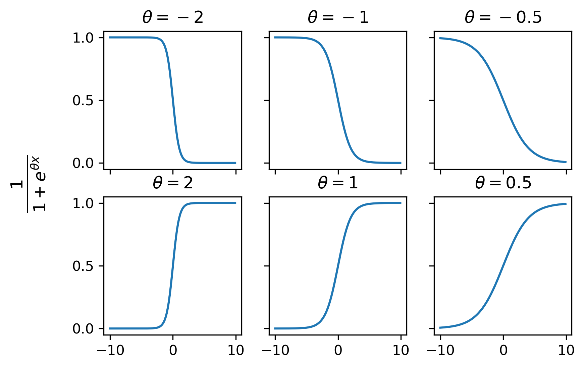

For starters it's kind of a misnomer to call it logistic *regression*, because it's actually used for classification problems not regression ones. The difference is that regression problems look at real valued outputs whereas classifications creates some threshold and when the output is above the threshold it gets mapped to 1 and 0 when it's below.

After we pick a threshold that remaps these points, we need a model. What we end up doing is applying a sigmoid function to our linear regression. Hence the name logistic regression.

$$ y = \sigma(\theta_0 + \theta_1 x) $$

The sigmoid function is a class of functions that maps all outputs to the interval between 0 and 1. A classic example of such a function is

$$ \sigma(t) = \frac{1}{1+e^t} $$

### How well does it perform
The most basic evaluation metric is **accuracy**

$$
\text{accuracy} = \frac{ \text{\# of points classified correctly}}{ \text{\# points total}}
$$

Pitfalls to watch out for: if you have a spam filter with 100 emails, of which 5 are truly spam. If we made a classifier that always returned not spam it would return an accuracy of 95%, but it didn't catch any of the spam emails. So we need more than just accuracy to get a better understanding.

- **True Positive/Negative** when we correctly classify an observation.
- **False positives** false alarms
- **False negatives** failed to detect

Other metrics to consider
$$
\text{accuracy} = \frac{ \text{TP} + \text{TN}}{n}
$$
Accuracy: What proportion of points did our classifier classify correctly.

$$
\text{precision} = \frac{\text{TP}}{\text{TP} + \text{FP}}
$$
Precision: Of all our observations that we classified as 1, how many were actually 1. This penalizes false positives.

$$
\text{recall} = \frac{ \text{TP}}{ \text{TP} + \text{FN}}
$$
Recall: Of all the observations that were actually 1, how many did we classify as 1. This penalizes false negatives.

There is a tradeoff between precision and recall. Looking back to our email example, if we had our classifier classify every email as spam (1), we would have no false negatives and would achieve a recall of 100%, however, our precision would be low. 

Adjusting the threshold of our classifier can help us achieve a balance.
- Higher threshold - fewer false positives. Precision tends to increase.
- Lower threshold - fewer false negativers. Recall tends to increase.

### Receiver Operator Characteristic (ROC) Curve 

Let's introduce two more metrics
**False Positive Rate (FPR)**
- What proportion of innocent people did I convict
- FP / (FP + TN)

**True Positive Rate(TPR)**
- What proportion of guilty people did I convict - same thing as recall
- TP / (TP + FN)

ROC curve plots TPR vs. FPR. The "perfect" classifier is one that has a TPR of 1 and a FPR of 0. We can compute the **area under the curve (AUC)** of our model, in which the best possible case would be AUC = 1. 

Two more metrics to know.
**Sensitivity** (True Positive Rate)
- TP / (TP + FN)
- The same thing as recall, and True Positive Rate

**Specificity** (True Negative Rate)
- TN / (TN + FP)
